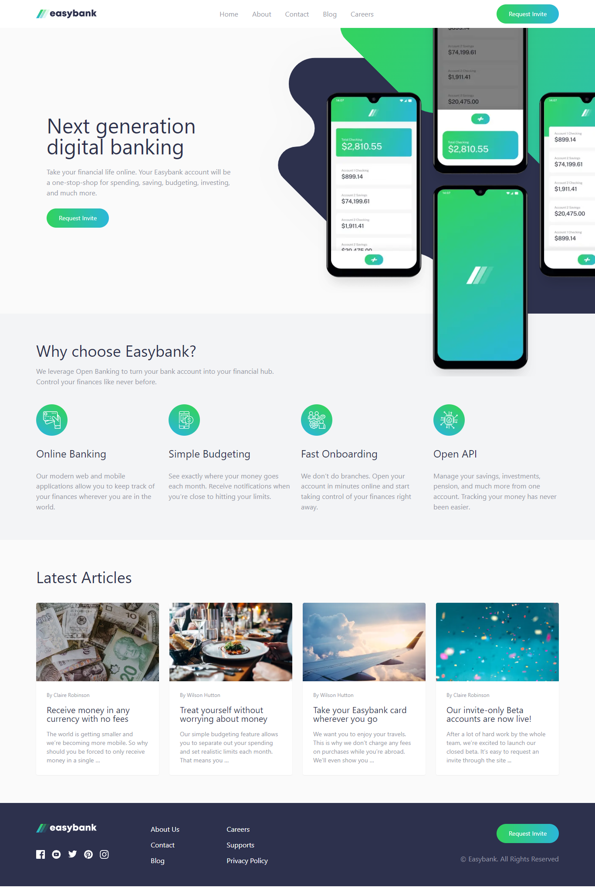

# Frontend Mentor - Easybank landing page solution

This is a solution to the [Easybank landing page challenge on Frontend Mentor](https://www.frontendmentor.io/challenges/easybank-landing-page-WaUhkoDN). Frontend Mentor challenges help you improve your coding skills by building realistic projects.

## Table of contents

- [Frontend Mentor - Easybank landing page solution](#frontend-mentor---easybank-landing-page-solution)
  - [Table of contents](#table-of-contents)
  - [Overview](#overview)
    - [The challenge](#the-challenge)
    - [Screenshot](#screenshot)
    - [Links](#links)
  - [My process](#my-process)
    - [Built with](#built-with)
    - [Useful resources](#useful-resources)
  - [Author](#author)
  - [Acknowledgments](#acknowledgments)

**Note: Delete this note and update the table of contents based on what sections you keep.**

## Overview

### The challenge

Users should be able to:

- View the optimal layout for the site depending on their device's screen size
- See hover states for all interactive elements on the page

### Screenshot

### Links

- Solution URL: [https://www.frontendmentor.io/solutions/mobile-first-using-tailwind-reactjs-and-typescript-NceVL2HvV6](https://www.frontendmentor.io/solutions/mobile-first-using-tailwind-reactjs-and-typescript-NceVL2HvV6)
- Live Site URL: [https://easybank-easydek.netlify.app/](https://easybank-easydek.netlify.app/)

## My process

### Built with

- Semantic HTML5 markup
- TailwindCSS
- Flexbox
- CSS Grid
- Mobile-first workflow
- [React](https://reactjs.org/) - JS library

### Useful resources

- [https://faha1999.github.io/easybank-landing-page/](https://faha1999.github.io/easybank-landing-page/) - This helped me for implementing responsive image in the intro section

## Author

- Website - [Wafa Saefulhaq](https://github.com/wafash08)
- Frontend Mentor - [@wafash08](https://www.frontendmentor.io/profile/wafash08)
- Twitter - [@saefulhaqwafa](https://twitter.com/saefulhaqwafa)

## Acknowledgments

- this solution [https://faha1999.github.io/easybank-landing-page/](https://faha1999.github.io/easybank-landing-page/) gives me inspirations and ways to solve responsive image in the intro section
